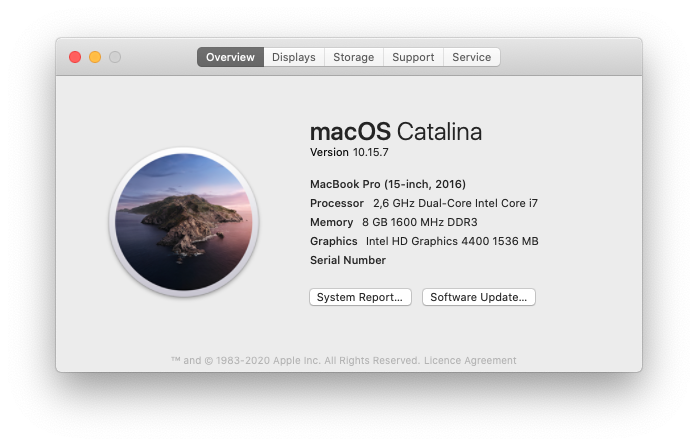
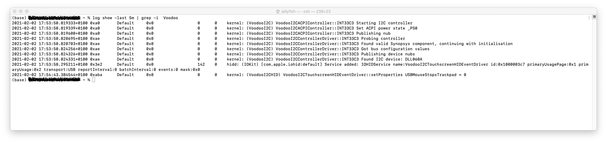
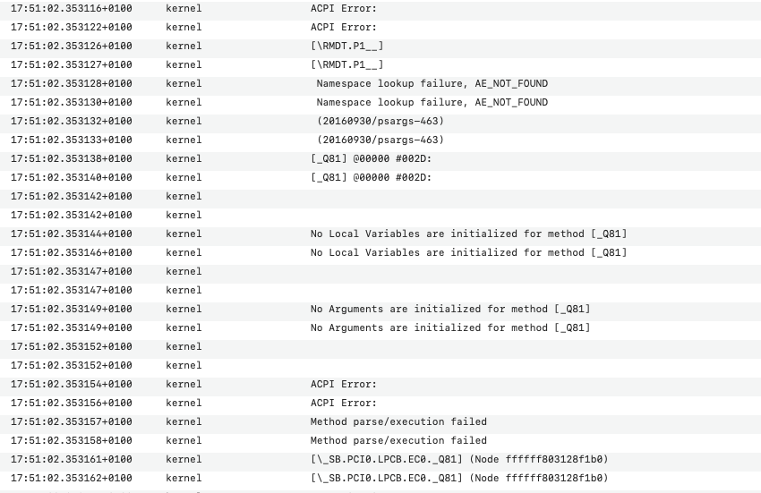

# opencore-dell-xps-13-9333
[](https://github.com/dwyl/esta/issues)

A documentation about my progress setting up macOS Catalina on a Dell XPS 13 9333. This is not meant to be a guide. It's rather a collection of certain problems I have encountered during installation and how they got solved. See this just as another source of information for troubleshooting.

## System


## WiFi / Bluetooth

### Intel Wireless AC 7260
This is the wifi card already builtin in the Dell XPS 13 9333. For your first setup you can use [itlwm](https://openintelwireless.github.io/itlwm/) in combination with [HeliPort](https://openintelwireless.github.io/HeliPort/).
### Broadcom DW1820A
I swapped the original wifi chip for the DW1820A since I was able to get it for a lower price than usual. Keep in mind that the DW1820 and DW180**A** are two different models.

#### 5GHz connection not working
Out of the box I was not able to connect to any 5GHz network. In order to fix this problem I simply added ```brcmfx-country=XX``` to my ```PciRoot(0x0)/Pci(0x1C,0x2)/Pci(0x0,0x0)``` under DeviceProperties. ```XX = your country code, e.g. US```. To figure out the device ID of your network card you can either use [gfxutil](https://github.com/acidanthera/gfxutil/releases) or [Hackintool](https://github.com/headkaze/Hackintool). Didn't have to make any further adjustments.

#### Bluetooth not working
At some point I encountered a weird bug(?) where I was not able to get any bluetooth connectivity at all. The solution to this problem was even weirder. Booting into my linux system from a USB stick, verifying that bluetooth actually works, and then booting back to macOS solved the bluetooth problem and hasn't occured since. 

## Trackpad
### VoodooPS2 (the easy way)
This is the easy solution to get your trackpad and gestures working. Just use [VoodooPS2 Version 2.1.9](https://github.com/acidanthera/VoodooPS2/releases/tag/2.1.9). As of writing version 2.2.0 was released which didn't seem to work with this particular system.

**Update:** version 2.2.0 seems to work after applying following changes to my system through terminal.
```
sudo pmset -a hibernatemode 0
sudo pmset -a proximitywake 0
```

**Note:** I noticed that using my custom ```SSDTs``` below causes the trackpad and keyboard to stop working. The keyboard works again after closing and opening the lid of the laptop. At this point I keep using a patched ```DSDT``` until I figure out how to solve this problem.

**Note:** VoodooI2C is working now. I didn't keep investigating the problem described above any further. Moving away from a single ```DSDT``` to custom ```SSDTs``` solved any other problems that occured previously.

### VoodooI2C (the non easy way)
Trying to setup VoodooI2C over several days only resulted in the trackpad working with basic features. Gestures and scrolling doesn't seem to function on the Dell XPS 13 9333 this way. The trackpad gets recognised as ```TPD1```, but using VoodooI2C in combination with VoodooI2CHID and remvoing the interrupt sequence as suggested causes the trackpad to run in polling mode only (as seen in the ```system.log```).
Further research might be required at this point. As of now the results with VoodooPS2 are good enough.

**Update:** Trackpad over I2C is working with full gesture support now. I had to use [VoodooI2C](https://github.com/VoodooI2C/VoodooI2C) in combination with [VoodooRMI](https://github.com/VoodooSMBus/VoodooRMI). 

In my case I had to rename the I2C Serial Bus name **SBFI** to **SBFB**. The ```SSDT-I2C.aml``` for the GPI0 Pinning looks like this.

```
DefinitionBlock ("", "SSDT", 2, "hack", "I2C", 0x00000000)
{
    External (_SB_.PCI0.I2C1.TPD1, DeviceObj)

    Scope (_SB.PCI0.I2C1.TPD1)
    {
        Method (_CRS, 0, Serialized)  // _CRS: Current Resource Settings
        {
            Name (SBFB, ResourceTemplate ()
            {
                I2cSerialBusV2 (0x002C, ControllerInitiated, 0x00061A80,
                    AddressingMode7Bit, "\\_SB.PCI0.I2C1",
                    0x00, ResourceConsumer, , Exclusive,
                    )
            })
            Return (SBFB) /* \_SB_.PCI0.I2C1.TPD1._CRS.SBFB */
        }
    }
}
```

The ```voodoo.log```is also showing that the device is being recognized.


## Brightness Keys SSDT Hotpatch
Use the [ACPIdebug.kext](https://github.com/RehabMan/OS-X-ACPI-Debug) to figure out which methods need to be patched. Refer to the section [Brightness Keys](https://www.tonymacx86.com/threads/guide-patching-dsdt-ssdt-for-laptop-backlight-control.152659/) for more information. Monitor the ```Console.app``` while pressing your key-combinaton to change the brightness. You should get something like this:



The ```system.log``` shows us that we have to patch the methods ```_Q80``` and ```_Q81```. Apply following patch to your ```DSDT.dsl```

```
into method label _Q80 replace_content
begin
// Brightness Up\n
    Notify(\_SB.PCI0.LPCB.PS2K, 0x0406)\n
end;
into method label _Q81 replace_content
begin
// Brightness Down\n
    Notify(\_SB.PCI0.LPCB.PS2K, 0x0405)\n
end;
```
Now in order to create the ```SSDT-XKEY.aml``` we use the tool [Diffmerge](https://sourcegear.com/diffmerge/) to see what changes were made in the ```DSDT.dsl```.
Our final result looks like this.

<details>
  <summary>SSDT-XKEY.aml Codeblock</summary>
  
  
  
  ```
  DefinitionBlock ("", "SSDT", 2, "hack", "XKEY", 0x00000000)
{
    External (_SB_.PCI0.LPCB.EC0, DeviceObj)    // (from opcode)
    External (_SB_.PCI0.LPCB.PS2K, DeviceObj)    // (from opcode)

    Scope (_SB.PCI0.LPCB.EC0)
    {
        Method (_Q80, 0, NotSerialized)  // _Qxx: EC Query
        {
            Notify (\_SB.PCI0.LPCB.PS2K, 0x0406)
        }
        
        Method (_Q81, 0, NotSerialized)  // _Qxx: EC Query
        {
            Notify (\_SB.PCI0.LPCB.PS2K, 0x0405)
        }  
    }
}
  ```
  
</details>


## Battery SSDT Hotpatch
Before you try to hotpatch your battery I recommend to read this entire guide several times [Battery Status Hotpatch](https://www.tonymacx86.com/threads/guide-using-clover-to-hotpatch-acpi.200137/). The whole process of creating your own ```SSDT``` won't be discussed here. Adding the necessary methods into the right scopes shouldn't be too difficult. I think the only interesting part showing is the final trimmed  ```OperationRegion``` which looks like this. 

```
            Offset (0xA0), 
            CAPX,8,CAPY,8, 
            /*RCP0*/,   16, 
            VOTX,8,VOTY,8, 
            CRTX,8,CRTY,8, 
            /*BTM0*/,   16, 
            /*BST0*/,   16, 
            /*BRC0*/,   16, 
            FCPX,8,FCPY,8, 
            DCPX,8,DCPY,8, 
            DVTX,8,DVTY,8, 
            /*MER0*/,   16, 
            /*MFD0*/,   16, 
            BSNX,8,BSNY,8
```

This is how the final ```SSDT-XBAT.aml``` looks like.
<details>
  <summary>SSDT-XBAT.aml Codeblock</summary>
  
  
  
  ```
  DefinitionBlock ("", "SSDT", 2, "hack", "XBATT", 0x00000000)
{
 
    External (_SB.BAT0, DeviceObj)  
    External (_SB.PCI0.LPCB.EC0, DeviceObj)
    External (_SB.PCI0.LPCB.EC0.DCPX, DeviceObj)
    External (_SB.PCI0.LPCB.EC0.DCPY, DeviceObj)
    External (_SB.PCI0.LPCB.EC0.FCPX, DeviceObj)
    External (_SB.PCI0.LPCB.EC0.FCPY, DeviceObj)
    External (_SB.PCI0.LPCB.EC0.DVTX, DeviceObj)
    External (_SB.PCI0.LPCB.EC0.DVTY, DeviceObj)
    External (_SB.PCI0.LPCB.EC0.BSNX, DeviceObj)
    External (_SB.PCI0.LPCB.EC0.BSNY, DeviceObj)
    External (_SB.PCI0.LPCB.EC0.CAPX, DeviceObj)
    External (_SB.PCI0.LPCB.EC0.CAPY, DeviceObj)
    External (_SB.PCI0.LPCB.EC0.VOTX, DeviceObj)
    External (_SB.PCI0.LPCB.EC0.VOTY, DeviceObj)
    External (_SB.PCI0.LPCB.EC0.CRTX, DeviceObj)
    External (_SB.PCI0.LPCB.EC0.CRTY, DeviceObj)
    
    External (_SB.PCI0.LPCB.EC0.DNN0, IntObj)
    External (_SB.PCI0.LPCB.EC0.BCN0, IntObj)
    External (_SB.PCI0.LPCB.EC0.MNN0, IntObj)
    External (_SB.PCI0.LPCB.EC0.B0DC, IntObj)
    External (_SB.PCI0.LPCB.EC0.B0IC, IntObj)
    External (_SB.PCI0.LPCB.EC0.B0CL, IntObj)
    
    External (_SB.PCI0.LPCB.EC0.MUT0, MethodObj)
    External (PAK0, MethodObj)
    External (ITOS, MethodObj)
    External (BFB0, MethodObj)
    External (PWRS, MethodObj)

    
    Method (B1B2, 2, NotSerialized) { Return (Or (Arg0, ShiftLeft (Arg1, 8))) }
    
    Scope (_SB.PCI0.LPCB.EC0)
    {
        OperationRegion (XCRM, EmbeddedControl, Zero, 0x0100)
        Field (XCRM, ByteAcc, Lock, Preserve)
        {
            Offset (0xA0), 
            CAPX,8,CAPY,8, 
            /*RCP0*/,   16, 
            VOTX,8,VOTY,8, 
            CRTX,8,CRTY,8, 
            /*BTM0*/,   16, 
            /*BST0*/,   16, 
            /*BRC0*/,   16, 
            FCPX,8,FCPY,8, 
            DCPX,8,DCPY,8, 
            DVTX,8,DVTY,8, 
            /*MER0*/,   16, 
            /*MFD0*/,   16, 
            BSNX,8,BSNY,8
        }   
    }
   
    Scope (_SB.BAT0)
    {
        Method (_BIF, 0, Serialized)  // _BIF: Battery Information
        {
            Store ("BIF0", Debug)
            Acquire (^^PCI0.LPCB.EC0.MUT0, 0xFFFF)
            Store (B1B2(^^PCI0.LPCB.EC0.DCPX,^^PCI0.LPCB.EC0.DCPY), Index (PAK0, One))
            Store (B1B2(^^PCI0.LPCB.EC0.FCPX,^^PCI0.LPCB.EC0.FCPY), Local0)
            Store (Local0, Index (PAK0, 0x02))
            Store (B1B2(^^PCI0.LPCB.EC0.DVTX,^^PCI0.LPCB.EC0.DVTY), Index (PAK0, 0x04))
            Store (^^PCI0.LPCB.EC0.DNN0, Local1)
            Store (B1B2(^^PCI0.LPCB.EC0.BSNX,^^PCI0.LPCB.EC0.BSNY), Local2)
            Store (^^PCI0.LPCB.EC0.BCN0, Local3)
            Store (^^PCI0.LPCB.EC0.MNN0, Local4)
            Release (^^PCI0.LPCB.EC0.MUT0)
            Store (Divide (Local0, 0x0A, ), Index (PAK0, 0x05))
            Store (Zero, Index (PAK0, 0x06))
            Switch (ToInteger (Local1))
            {
                Case (Zero)
                {
                    Store ("Unknow", Index (PAK0, 0x09))
                }
                Case (0xFF)
                {
                    Store ("Dell", Index (PAK0, 0x09))
                }
            }

            Store (ITOS (ToBCD (Local2)), Index (PAK0, 0x0A))
            Switch (ToInteger (Local3))
            {
                Case (Zero)
                {
                    Store ("Unknow", Index (PAK0, 0x0B))
                }
                Case (One)
                {
                    Store ("PBAC", Index (PAK0, 0x0B))
                }
                Case (0x02)
                {
                    Store ("LION", Index (PAK0, 0x0B))
                }
                Case (0x03)
                {
                    Store ("NICD", Index (PAK0, 0x0B))
                }
                Case (0x04)
                {
                    Store ("NIMH", Index (PAK0, 0x0B))
                }
                Case (0x05)
                {
                    Store ("NIZN", Index (PAK0, 0x0B))
                }
                Case (0x06)
                {
                    Store ("RAM", Index (PAK0, 0x0B))
                }
                Case (0x07)
                {
                    Store ("ZNAR", Index (PAK0, 0x0B))
                }
                Case (0x08)
                {
                    Store ("LIP", Index (PAK0, 0x0B))
                }
                
            }

            Switch (ToInteger (Local4))
            {
                Case (Zero)
                {
                    Store ("Unknow", Index (PAK0, 0x0C))
                }
                Case (One)
                {
                    Store ("Dell", Index (PAK0, 0x0C))
                }
                Case (0x02)
                {
                    Store ("SONY", Index (PAK0, 0x0C))
                }
                Case (0x03)
                {
                    Store ("SANYO", Index (PAK0, 0x0C))
                }
                Case (0x04)
                {
                    Store ("PANASONIC", Index (PAK0, 0x0C))
                }
                Case (0x05)
                {
                    Store ("SONY_OLD", Index (PAK0, 0x0C))
                }
                Case (0x06)
                {
                    Store ("SDI", Index (PAK0, 0x0C))
                }
                Case (0x07)
                {
                    Store ("SIMPLO", Index (PAK0, 0x0C))
                }
                Case (0x08)
                {
                    Store ("MOTOROLA", Index (PAK0, 0x0C))
                }
                Case (0x09)
                {
                    Store ("LGC", Index (PAK0, 0x0C))
                }
            }
            Return (PAK0)
        } 
        
        Method (_BST, 0, NotSerialized)  // _BST: Battery Status
        {
            Acquire (^^PCI0.LPCB.EC0.MUT0, 0xFFFF)
            Store (^^PCI0.LPCB.EC0.B0DC, Local0)
            Store (^^PCI0.LPCB.EC0.B0IC, Local1)
            ShiftLeft (Local1, One, Local1)
            Add (Local0, Local1, Local0)
            Store (^^PCI0.LPCB.EC0.B0CL, Local1)
            Release (^^PCI0.LPCB.EC0.MUT0)
            ShiftLeft (Local1, 0x02, Local1)
            Add (Local0, Local1, Local0)
            Store (Local0, Index (BFB0, Zero))
            Acquire (^^PCI0.LPCB.EC0.MUT0, 0xFFFF)
            Store (B1B2(^^PCI0.LPCB.EC0.CAPX,^^PCI0.LPCB.EC0.CAPY), Index (BFB0, 0x02))
            Store (B1B2(^^PCI0.LPCB.EC0.VOTX,^^PCI0.LPCB.EC0.VOTY), Index (BFB0, 0x03))
            Release (^^PCI0.LPCB.EC0.MUT0)
            Acquire (^^PCI0.LPCB.EC0.MUT0, 0xFFFF)
            Store (B1B2(^^PCI0.LPCB.EC0.CRTX,^^PCI0.LPCB.EC0.CRTY), Local0)
            Release (^^PCI0.LPCB.EC0.MUT0)
            If (LEqual (Local0, Zero))
            {
                Increment (Local0)
            }
            ElseIf (PWRS)
            {
                If (And (Local0, 0x8000))
                {
                    Store (Ones, Local0)
                }
            }
            ElseIf (And (Local0, 0x8000))
            {
                Subtract (Zero, Local0, Local0)
                And (Local0, 0xFFFF, Local0)
            }
            Else
            {
                Store (Ones, Local0)
            }
            
            Store (Local0, Index (BFB0, One))
            Return (BFB0)
       }
    }
}
  ```
  
</details>

**Note:** I'm not an expert at hotpatching. This hotpatch might work on my system, but I can't guarantee it will work on yours. Use at your own risk. (You should create your own hotpatch anyways.)

## Audio (ALC668)
The audio device ```ALC3661``` is a rebrand of the ```ALC668```. In order to get the audio working you have to apply the ```layout-id``` mentioned under 
[supported codecs](https://github.com/acidanthera/AppleALC/wiki/Supported-codecs). In my case the ```layout-id=3``` seems to be working fine. If you're trying to get your audio working while using an active ```DSDT.aml``` in your ACPI folder you have to create a SSDT hotpatch instead of using the ```DSDT.aml```. An active ```DSDT.aml``` caused my audio not to function during debugging.

## Credits
- [acidanthera](https://github.com/acidanthera) 
- [RehabMan](https://github.com/RehabMan)
- [OpenIntelWireless](https://github.com/OpenIntelWireless)
- [Dortania Guides](https://dortania.github.io/getting-started/)
- [headkaze](https://github.com/headkaze)
- [VoodooSMBus](https://github.com/VoodooSMBus/VoodooRMI)

